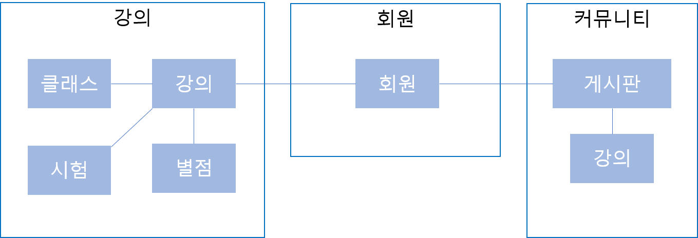
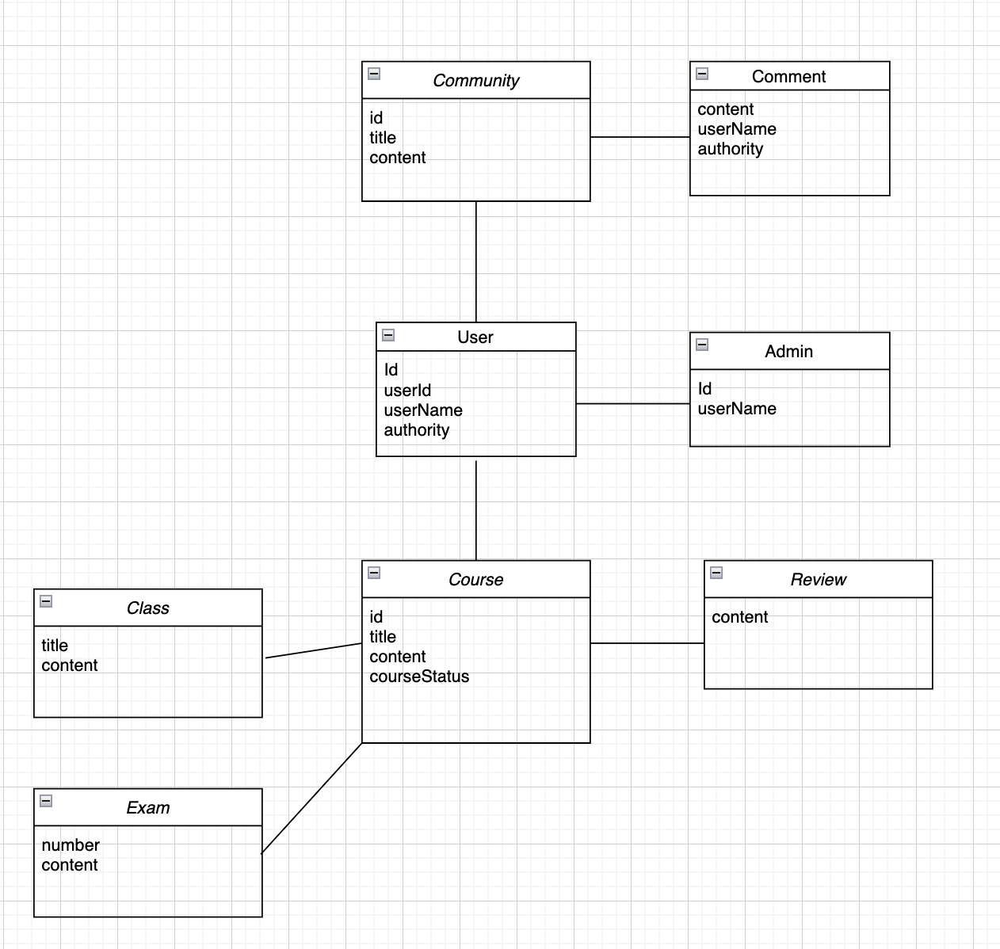

# webflux_week2

## 도메인 설계

  

  

## Port
~~~
 web 8080
 user 8081
 course 8082
 community 8083
~~~

## domain
~~~
 class User : 유저(학생)정보를 저장하는 클래스
 class Admin: 운영자 정보를 저장하는 클래스
 class Teacher : 강사 정보를 저장하는 클래스
 class Course: 강의 정보를 저장하는 클래스
 class Exam : 시험 정보를 저장하는 클래스
 class Evaluate : 별점 정보를 저장하는 클래스
 class Community : 커뮤니티 정보를 저장하는 클래스
 class Comment : 댓글 정보를 저장하는 클래스
~~~

## service 
~~~
 UserService : 회원가입, 로그인 기능 담당
 AdminService : 운영자의 관점으로 강사 할당 기능 담당
 CourseService : 강의 조회/등록/수정/삭제 기능 담당
 CommunityService : 게시판 조회/등록/수정/삭제 기능 담당
~~~

## REST API
| Name | Route                                  |
| ------ |----------------------------------------|
|회원가입 | /signup                                |
|로그인 | /login                                 |
|수강 신청한 강의 | /my-courses                            |
|강사 생성 | /admin/create/teacher                  |
|강의 생성 | /admin/create/course                   |
|강의 목록 | /courses                               |
|강의 세부 내용 | /course/{courseid}                     |
|강의 클래스 | /course/{courseid}/lecture/{lectureid} |
|강의 시험 | /course/{courseid}/exam                |
|강의 별점 | /course/{courseid}/review              |
|커뮤니티  | /community                             |
| 커뮤니티 게시글 | /community/post/{postid}               |
