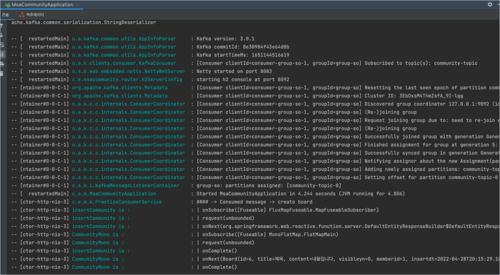

# Community

## kafka
- 컨슈머 앱을 자유롭게 구성하거나, 강의 플랫폼 도메인 중 하나를 골라 카프카 브로커로 송신된 이벤트 토픽을 구독해보세요.

### \> 게시판 도메인에서 게시글 저장 API 가 수신되면 DB 에 저장하면서 동시에 카프카 브로커로 토픽 이벤트 전송
[kafka message](https://github.com/qpyu66/webflux_week2/blob/4ebadd2a7f560ac13638ceb277fc14b5c170699e/msa-community/src/main/java/com/example/msacommunity/handler/BoardHandler.java)

[kafka config](https://github.com/qpyu66/webflux_week2/blob/784317d8a1e675ffb84142a2b6883de19c4c4abe/msa-community/src/main/java/com/example/msacommunity/kafkapractice)

  

